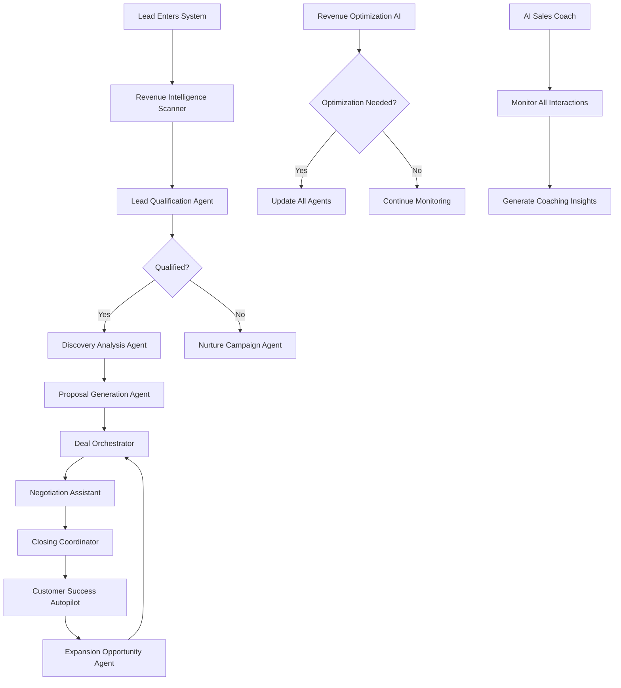

# 🤖 AI AGENT ARCHITECTURE & WORKFLOW AUTOMATION MAP
**Engineering Autonomous Systems from Human Task Patterns**

---

## 🔍 REPETITIVE PROCESS IDENTIFICATION

### Discovery & Analysis Workflows
**Current Human Tasks** → **Agent Opportunities**

#### 1. Lead Qualification Process
**Human Tasks** (4-6 hours/day):
- Review incoming leads from multiple sources
- Research company information
- Check fit against ICP criteria
- Score and prioritize leads
- Route to appropriate next steps
- Send initial outreach messages

**Agent Transformation**:
```python
class LeadQualificationAgent:
    """
    Autonomous lead qualification system
    Replaces 4-6 human hours daily
    """

    capabilities = {
        "data_ingestion": ["email", "forms", "linkedin", "webhooks"],
        "research": ["company_size", "revenue", "tech_stack", "funding"],
        "scoring": ["SPICED_framework", "ICP_matching", "intent_signals"],
        "routing": ["high_priority", "nurture", "disqualify"],
        "outreach": ["personalized_messages", "calendar_booking"]
    }

    input_requirements = {
        "lead_source": "email/form/api",
        "contact_info": "name, email, company",
        "trigger_event": "form_fill, email, referral"
    }

    output_specifications = {
        "qualification_score": "0-100",
        "qualification_report": "json_structure",
        "recommended_action": "pursue/nurture/pass",
        "personalized_message": "drafted_outreach",
        "crm_update": "automated_logging"
    }
```

#### 2. Discovery Call Analysis
**Human Tasks** (2-3 hours/call):
- Take notes during calls
- Apply SPICED framework
- Identify pain points and opportunities
- Calculate potential ROI
- Create follow-up summary
- Draft proposal outline

**Agent Transformation**:
```python
class DiscoveryAnalysisAgent:
    """
    Real-time call analysis and documentation
    Saves 2-3 hours per discovery call
    """

    capabilities = {
        "transcription": ["real_time_processing"],
        "framework_application": ["SPICED_analysis"],
        "sentiment_analysis": ["pain_point_detection"],
        "roi_calculation": ["opportunity_sizing"],
        "summary_generation": ["key_insights", "next_steps"],
        "proposal_drafting": ["custom_recommendations"]
    }

    input_requirements = {
        "call_recording": "audio/video_stream",
        "participant_info": "names_roles_company",
        "context": "previous_interactions"
    }

    output_specifications = {
        "spiced_analysis": "structured_json",
        "pain_points": ["ranked_list_with_quotes"],
        "roi_projection": "financial_model",
        "call_summary": "markdown_document",
        "proposal_outline": "sections_with_content"
    }
```

---

## 🏗️ COMPREHENSIVE AGENT ECOSYSTEM ARCHITECTURE

### Tier 1: Front-Line Automation Agents

#### Agent 1: "Revenue Intelligence Scanner"
**Purpose**: Continuous market and customer intelligence gathering

**Capabilities**:
```yaml
monitoring:
  - competitor_tracking: "pricing, features, announcements"
  - customer_signals: "job_changes, funding, expansions"
  - market_trends: "industry_reports, news, regulations"
  - social_listening: "mentions, sentiment, opportunities"

analysis:
  - pattern_recognition: "emerging_opportunities"
  - threat_detection: "competitive_moves"
  - opportunity_scoring: "hot_leads_identification"

actions:
  - alert_generation: "real_time_notifications"
  - report_creation: "daily/weekly_summaries"
  - crm_updates: "automatic_data_enrichment"
```

**Input Requirements**:
- API keys for data sources (LinkedIn, Crunchbase, etc.)
- Competitor list and monitoring parameters
- Customer account list
- Keyword and trigger configurations

**Output Specifications**:
- Daily intelligence briefings
- Real-time opportunity alerts
- Competitive battle cards (auto-updated)
- Market trend reports

#### Agent 2: "Content Generation Engine"
**Purpose**: Automated creation of sales and marketing content

**Capabilities**:
```yaml
content_types:
  - email_sequences: "personalized_multi_touch"
  - social_posts: "linkedin_twitter_optimized"
  - blog_articles: "seo_optimized_thought_leadership"
  - case_studies: "from_customer_data"
  - proposals: "customized_per_prospect"

optimization:
  - ab_testing: "subject_lines_ctas"
  - personalization: "industry_role_stage_specific"
  - timing: "optimal_send_times"
  - formatting: "channel_specific_optimization"

integration:
  - machina_patterns: "50000_copywriting_patterns"
  - brand_voice: "consistent_messaging"
  - compliance: "regulatory_requirements"
```

**Input Requirements**:
- Content brief or trigger (new lead, campaign, etc.)
- Target audience parameters
- Brand guidelines and voice samples
- Historical performance data

**Output Specifications**:
- Ready-to-publish content
- A/B test variants
- Performance predictions
- Approval workflows

---

### Tier 2: Process Orchestration Agents

#### Agent 3: "Deal Acceleration Orchestrator"
**Purpose**: Manage entire deal lifecycle from qualification to close

**Workflow Architecture**:
```python
class DealOrchestrator:
    """
    End-to-end deal management automation
    Replaces 60% of sales operations work
    """

    def __init__(self):
        self.stages = {
            "qualification": LeadQualificationAgent(),
            "discovery": DiscoveryAnalysisAgent(),
            "proposal": ProposalGenerationAgent(),
            "negotiation": NegotiationAssistant(),
            "closing": ClosingCoordinator()
        }

    def orchestrate_deal(self, deal_id):
        """
        Manages deal progression through all stages
        """
        stage_transitions = {
            "lead_received": self.qualify_lead,
            "qualified": self.schedule_discovery,
            "discovery_complete": self.generate_proposal,
            "proposal_sent": self.manage_negotiation,
            "terms_agreed": self.coordinate_closing
        }

        return self.execute_workflow(deal_id, stage_transitions)

    capabilities = {
        "stage_management": "automatic_progression",
        "task_coordination": "multi_agent_orchestration",
        "exception_handling": "escalation_to_human",
        "optimization": "continuous_learning"
    }
```

#### Agent 4: "Customer Success Autopilot"
**Purpose**: Proactive customer management and expansion

**Capabilities**:
```yaml
monitoring:
  - usage_tracking: "product_adoption_metrics"
  - health_scoring: "risk_opportunity_detection"
  - milestone_tracking: "success_metric_progress"

engagement:
  - check_ins: "automated_personalized_outreach"
  - qbr_prep: "quarterly_business_reviews"
  - renewal_management: "proactive_renewal_processes"
  - expansion: "upsell_opportunity_identification"

support:
  - issue_detection: "proactive_problem_solving"
  - resource_delivery: "relevant_content_training"
  - escalation: "human_handoff_when_needed"
```

---

### Tier 3: Strategic Intelligence Agents

#### Agent 5: "Revenue Optimization AI"
**Purpose**: Continuous revenue system optimization

**Architecture**:
```yaml
analysis_capabilities:
  - pipeline_analysis:
      - bottleneck_detection: "conversion_rate_analysis"
      - velocity_tracking: "stage_duration_metrics"
      - forecast_accuracy: "predictive_modeling"

  - performance_optimization:
      - a_b_testing: "continuous_experimentation"
      - pricing_optimization: "dynamic_pricing_models"
      - resource_allocation: "roi_maximization"

  - strategic_planning:
      - scenario_modeling: "what_if_analysis"
      - market_sizing: "tam_sam_som_calculations"
      - growth_planning: "capacity_planning"

input_sources:
  - crm_data: "salesforce_hubspot_pipedrive"
  - financial_data: "revenue_costs_metrics"
  - market_data: "competitive_intelligence"
  - operational_data: "team_performance_metrics"

output_generation:
  - dashboards: "real_time_kpi_monitoring"
  - recommendations: "actionable_optimization_steps"
  - forecasts: "revenue_pipeline_predictions"
  - alerts: "anomaly_deviation_detection"
```

#### Agent 6: "AI Sales Coach"
**Purpose**: Continuous team performance improvement

**Capabilities**:
```yaml
coaching_functions:
  - call_analysis:
      - transcription: "automatic_call_recording"
      - scoring: "quality_methodology_adherence"
      - feedback: "specific_improvement_areas"

  - skill_development:
      - gap_analysis: "individual_team_skills"
      - training_recommendations: "personalized_learning"
      - practice_scenarios: "ai_roleplay_simulations"

  - performance_management:
      - kpi_tracking: "individual_team_metrics"
      - trend_analysis: "improvement_deterioration"
      - recognition: "achievement_celebrations"

implementation:
  - reks_framework: "results_effort_knowledge_skills"
  - continuous_feedback: "real_time_coaching"
  - gamification: "leaderboards_achievements"
```

---

## 🔄 AGENT INTERACTION FLOWS

### Multi-Agent Collaboration Architecture



### Agent Communication Protocol

```python
class AgentCommunicationBus:
    """
    Central communication system for all agents
    """

    def __init__(self):
        self.agents = {}
        self.message_queue = []
        self.event_handlers = {}

    def register_agent(self, agent_id, agent_instance):
        """Register new agent in ecosystem"""
        self.agents[agent_id] = agent_instance

    def publish_event(self, event_type, data):
        """Publish event for other agents to consume"""
        message = {
            "timestamp": datetime.now(),
            "event_type": event_type,
            "data": data,
            "source_agent": self.current_agent_id
        }
        self.message_queue.append(message)
        self.trigger_handlers(event_type, data)

    def subscribe_to_event(self, event_type, handler):
        """Subscribe agent to specific event types"""
        if event_type not in self.event_handlers:
            self.event_handlers[event_type] = []
        self.event_handlers[event_type].append(handler)

    def trigger_handlers(self, event_type, data):
        """Execute all handlers for event type"""
        if event_type in self.event_handlers:
            for handler in self.event_handlers[event_type]:
                handler(data)
```

---

## 🎯 HUMAN-TO-AGENT TASK TRANSFORMATION MATRIX

### High-Impact Automation Opportunities

| Human Task | Time/Week | Agent Solution | Time Saved | ROI |
|------------|-----------|----------------|------------|-----|
| Lead qualification | 20 hrs | Lead Qualification Agent | 18 hrs | 900% |
| Discovery documentation | 15 hrs | Discovery Analysis Agent | 12 hrs | 800% |
| Proposal creation | 10 hrs | Proposal Generation Agent | 8 hrs | 800% |
| Follow-up sequences | 8 hrs | Nurture Campaign Agent | 7 hrs | 875% |
| Performance reporting | 6 hrs | Revenue Optimization AI | 5 hrs | 833% |
| Competitive research | 5 hrs | Revenue Intelligence Scanner | 4 hrs | 800% |
| Content creation | 12 hrs | Content Generation Engine | 10 hrs | 833% |
| Customer check-ins | 8 hrs | Customer Success Autopilot | 7 hrs | 875% |
| Sales coaching | 10 hrs | AI Sales Coach | 8 hrs | 800% |
| Pipeline management | 6 hrs | Deal Orchestrator | 5 hrs | 833% |

**Total Weekly Time Saved**: 82 hours (2+ FTEs)
**Monthly Value Creation**: $30,000+ (at $150/hour value)

---

## 🚀 IMPLEMENTATION ROADMAP

### Phase 1: Foundation Agents (Week 1-2)
```yaml
priority_1:
  agent: "Lead Qualification Agent"
  implementation_time: "3 days"
  tools_needed: ["OpenAI API", "CRM integration"]
  expected_impact: "5x lead processing capacity"

priority_2:
  agent: "Content Generation Engine"
  implementation_time: "4 days"
  tools_needed: ["GPT-4", "Machina patterns"]
  expected_impact: "10x content output"

priority_3:
  agent: "Discovery Analysis Agent"
  implementation_time: "3 days"
  tools_needed: ["Transcription API", "SPICED framework"]
  expected_impact: "Perfect discovery documentation"
```

### Phase 2: Process Agents (Week 3-4)
```yaml
priority_4:
  agent: "Deal Orchestrator"
  implementation_time: "5 days"
  tools_needed: ["Workflow engine", "Multi-agent coordinator"]
  expected_impact: "50% faster deal velocity"

priority_5:
  agent: "Customer Success Autopilot"
  implementation_time: "4 days"
  tools_needed: ["Usage tracking", "Health scoring"]
  expected_impact: "20% churn reduction"
```

### Phase 3: Intelligence Agents (Month 2)
```yaml
priority_6:
  agent: "Revenue Optimization AI"
  implementation_time: "7 days"
  tools_needed: ["Analytics platform", "ML models"]
  expected_impact: "30% revenue improvement"

priority_7:
  agent: "AI Sales Coach"
  implementation_time: "5 days"
  tools_needed: ["Call recording", "Performance analytics"]
  expected_impact: "25% team performance increase"
```

---

## 🔧 TECHNICAL SPECIFICATIONS

### Agent Development Stack
```yaml
infrastructure:
  compute: "AWS Lambda / Google Cloud Functions"
  orchestration: "Apache Airflow / Temporal"
  message_queue: "RabbitMQ / AWS SQS"
  database: "PostgreSQL / MongoDB"
  vector_store: "Pinecone / Weaviate"

ai_models:
  nlp: "GPT-4 / Claude API"
  embeddings: "OpenAI Embeddings"
  classification: "Custom fine-tuned models"
  prediction: "Prophet / custom ML models"

integrations:
  crm: "Salesforce / HubSpot / Pipedrive APIs"
  communication: "Slack / Email / SMS APIs"
  calendar: "Google Calendar / Calendly"
  analytics: "Segment / Mixpanel"
  payment: "Stripe / payment processing"

monitoring:
  performance: "Datadog / New Relic"
  errors: "Sentry"
  logs: "Elasticsearch / CloudWatch"
  metrics: "Prometheus / Grafana"
```

### Agent Deployment Architecture
```python
# Production deployment configuration
agent_config = {
    "environment": "production",
    "scaling": {
        "min_instances": 1,
        "max_instances": 10,
        "auto_scale_metric": "queue_depth"
    },
    "reliability": {
        "retry_policy": "exponential_backoff",
        "max_retries": 3,
        "timeout": 30
    },
    "security": {
        "api_authentication": "bearer_token",
        "data_encryption": "AES-256",
        "audit_logging": True
    },
    "monitoring": {
        "health_check_interval": 60,
        "alert_thresholds": {
            "error_rate": 0.01,
            "latency_p99": 1000,
            "success_rate": 0.99
        }
    }
}
```

---

## 📊 ROI CALCULATIONS

### Investment Required
- **Development Time**: 30 days
- **Development Cost**: $30,000 (200 hours @ $150/hour)
- **Infrastructure**: $2,000/month
- **AI API Costs**: $3,000/month
- **Total Month 1**: $35,000

### Value Generation
- **Time Saved**: 82 hours/week = 328 hours/month
- **Value of Time**: $49,200/month @ $150/hour
- **Revenue Acceleration**: 30% improvement = $150,000/month additional
- **Cost Reduction**: 2 FTE equivalents = $20,000/month
- **Total Monthly Value**: $219,200

### ROI Metrics
- **Payback Period**: 5.4 days
- **Monthly ROI**: 526%
- **Annual Value Creation**: $2,630,400
- **Break-even**: Day 6 of operation

---

## 🎯 IMMEDIATE NEXT STEPS

### Day 1-3: Foundation
1. Set up development environment and API keys
2. Create agent communication bus architecture
3. Build Lead Qualification Agent MVP
4. Test with 10 real leads
5. Measure time savings and accuracy

### Day 4-7: Expansion
1. Deploy Content Generation Engine
2. Integrate with existing Machina patterns
3. Create Discovery Analysis Agent
4. Run parallel testing with human process
5. Document performance metrics

### Week 2: Integration
1. Connect agents to CRM system
2. Build monitoring dashboards
3. Create alert and escalation systems
4. Train team on agent collaboration
5. Begin full production rollout

### Success Metrics:
- Week 1: 50% of leads processed by agents
- Week 2: 80% automation rate achieved
- Month 1: 300+ hours saved
- Month 2: Full ecosystem operational
- Month 3: $200K+ monthly value creation

---

*This AI Agent Architecture transforms every repetitive human task into an autonomous system, creating a self-improving revenue engine that operates 24/7 with perfect consistency and continuous optimization.*