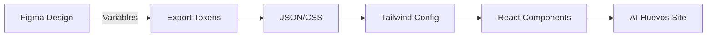

# Figma Integration for AI Huevos Brand Design System

## Overview

This document outlines approaches for integrating the AI Huevos brand design system with Figma for seamless designer-to-developer workflows.

## Approach 1: Figma Tokens/Variables (Recommended)

### Setup

1. **Create Design Tokens in Figma**:
   - Use Figma's Variables feature (Design > Variables)
   - Define color tokens matching brand_guidelines.md
   - Define typography tokens for Scandia and Geist Mono
   - Create spacing/sizing tokens based on egg character dimensions

2. **Token Structure**:
   ```
   Colors/
     Primary/
       yellow: #FFE03D
       blue: #4D9FFF
       black: #000000
       white: #FFFFFF
     Secondary/
       purple: #B8A0FF
       red: #FF5C3D
     Web/
       gray-light: #E5E5E5
       gray-dark: #9B9B9B

   Typography/
     Scandia/
       regular: Scandia Regular
       medium: Scandia Medium
     GeistMono/
       regular: Geist Mono Regular

   Spacing/
       egg-height: 90px (base unit 'X')
       logo-clearspace: 90px
   ```

3. **Export Tokens**:
   - Use Figma Tokens plugin or Figma Variables API
   - Export to JSON format
   - Convert to CSS variables or Tailwind config

### Workflow



## Approach 2: Component Library Sync

### Setup Using Figma to Code Tools

1. **Anima Plugin** (figma-to-react):
   - Install Anima plugin in Figma
   - Configure export settings for React/Next.js
   - Set up AI Huevos component library
   - Export components as React code

2. **Builder.io** (visual-to-code):
   - Connect Figma file to Builder.io
   - Map Figma components to React components
   - Auto-sync on Figma updates
   - Generate code with brand guidelines

3. **Figma API + Custom Script**:
   ```javascript
   // Example: Fetch Figma file and extract brand assets
   const figma = require('figma-api');
   const fs = require('fs');

   const api = new figma.Api({
     personalAccessToken: process.env.FIGMA_TOKEN
   });

   async function extractBrandAssets(fileKey) {
     const file = await api.getFile(fileKey);

     // Extract color styles
     const colors = file.styles
       .filter(s => s.styleType === 'FILL')
       .map(s => ({
         name: s.name,
         value: rgbToHex(s.color)
       }));

     // Extract typography styles
     const typography = file.styles
       .filter(s => s.styleType === 'TEXT')
       .map(s => ({
         name: s.name,
         fontFamily: s.fontFamily,
         fontSize: s.fontSize,
         letterSpacing: s.letterSpacing
       }));

     // Generate brand guidelines
     const guidelines = {
       colors,
       typography,
       components: extractComponents(file)
     };

     fs.writeFileSync(
       'brand_guidelines.json',
       JSON.stringify(guidelines, null, 2)
     );
   }
   ```

## Approach 3: Manual Export + Brand Compliance Check

### Workflow

1. **Designer Creates in Figma**:
   - Uses AI Huevos brand library
   - Follows brand_guidelines.md
   - Creates mockups/designs

2. **Export Assets**:
   - Export egg character SVGs
   - Export layouts as images for reference
   - Export specific measurements

3. **Developer Implementation**:
   - Reference Figma mockups
   - Hand-code using brand guidelines
   - Use prototype-hero.tsx as template
   - Run brand compliance check

4. **Brand Compliance Checker** (Custom Script):
   ```typescript
   // check-brand-compliance.ts
   import { parse } from '@babel/parser';
   import traverse from '@babel/traverse';
   import fs from 'fs';

   const APPROVED_COLORS = [
     '#FFE03D', '#4D9FFF', '#000000', '#FFFFFF',
     '#B8A0FF', '#FF5C3D', '#E5E5E5', '#9B9B9B'
   ];

   const APPROVED_FONTS = ['Scandia', 'Geist Mono'];

   function checkBrandCompliance(componentPath: string) {
     const code = fs.readFileSync(componentPath, 'utf-8');
     const ast = parse(code, { sourceType: 'module', plugins: ['jsx', 'typescript'] });

     const violations: string[] = [];

     traverse(ast, {
       StringLiteral(path) {
         const value = path.node.value;

         // Check for color hex codes
         if (value.match(/#[0-9A-F]{6}/i)) {
           if (!APPROVED_COLORS.includes(value.toUpperCase())) {
             violations.push(`Unapproved color: ${value}`);
           }
         }

         // Check for font families
         if (value.includes('font-family')) {
           const hasApprovedFont = APPROVED_FONTS.some(font =>
             value.includes(font)
           );
           if (!hasApprovedFont) {
             violations.push(`Unapproved font: ${value}`);
           }
         }
       }
     });

     return { compliant: violations.length === 0, violations };
   }

   // Usage
   const result = checkBrandCompliance('./prototype-hero.tsx');
   console.log(result.compliant ? '✓ Brand compliant' : '✗ Violations found:', result.violations);
   ```

## Approach 4: Figma Dev Mode + Inspect

### Setup

1. **Enable Dev Mode** in Figma file
2. **Developers inspect** designs directly
3. **Copy CSS/Tailwind** classes from Figma
4. **Verify** against brand_guidelines.md

### Benefits
- Real-time design-to-code
- Accurate spacing/measurements
- No export step needed

### Limitations
- Requires Figma Professional plan
- Manual copying of code
- Still needs brand compliance verification

## Recommended Workflow for AI Huevos

### Phase 1: Initial Setup
1. Create Figma component library with:
   - Color styles from brand_guidelines.md
   - Typography styles (Scandia, Geist Mono)
   - Egg character components (all 5 values)
   - Layout templates (hero, sections, cards)

2. Set up Figma Variables:
   - Map all brand colors
   - Create semantic tokens (primary, secondary, accent)
   - Define spacing based on egg height unit

3. Install Figma plugins:
   - Figma Tokens (for token export)
   - Anima or Builder.io (for code export)

### Phase 2: Design Workflow
1. Designer creates in Figma using brand library
2. Uses only approved colors/fonts/components
3. Exports tokens + components via plugin
4. Creates handoff documentation

### Phase 3: Development Workflow
1. Developer receives Figma link + exported tokens
2. Imports tokens to Tailwind config:
   ```javascript
   // tailwind.config.js
   const brandTokens = require('./brand-tokens.json');

   module.exports = {
     theme: {
       extend: {
         colors: brandTokens.colors,
         fontFamily: brandTokens.fonts,
         spacing: brandTokens.spacing
       }
     }
   }
   ```

3. Uses brand-designer.md skill to generate components
4. Runs brand compliance checker
5. Implements with brand guidelines

### Phase 4: Maintenance
1. Update Figma library when brand evolves
2. Re-export tokens automatically (CI/CD)
3. Update brand_guidelines.md
4. Regenerate components with new tokens

## Tools & Integrations

### Recommended Tools
- **Figma Tokens**: Best for design token management
- **Anima**: Good for component export to React
- **Storybook**: For component documentation and testing
- **Chromatic**: For visual regression testing

### Integration Stack
```
Figma → Tokens → JSON → Tailwind → React → Storybook → Deploy
  ↓                                           ↓
Brand Guidelines Check              Visual Regression Test
```

### Automation Script Example

```bash
#!/bin/bash
# sync-figma-brand.sh

echo "Fetching Figma tokens..."
curl -H "X-Figma-Token: $FIGMA_TOKEN" \
  "https://api.figma.com/v1/files/$FIGMA_FILE_KEY" \
  > figma-raw.json

echo "Converting to design tokens..."
node scripts/figma-to-tokens.js

echo "Updating Tailwind config..."
node scripts/update-tailwind.js

echo "Running brand compliance check..."
npm run check:brand

echo "✓ Brand sync complete!"
```

## Example: Full Integration Flow

1. **Designer** creates landing page hero in Figma
2. **Figma Tokens plugin** exports color/typography tokens
3. **Anima plugin** exports component structure to React
4. **Developer** reviews exported code
5. **brand-designer skill** validates against guidelines
6. **Compliance checker** runs automated checks
7. **Developer** makes adjustments if needed
8. **Deploy** brand-compliant component

## Brand Compliance Checklist

Before deploying any Figma-exported component:

- [ ] Colors match `brand_guidelines.md` palette
- [ ] Fonts are Scandia (sentence case) or Geist Mono (lowercase)
- [ ] Egg characters use approved colors (#FFE03D, #4D9FFF, #B8A0FF, #FF5C3D)
- [ ] Typography hierarchy follows brand specs (130px display, 100px H1, etc.)
- [ ] Spacing uses egg height (90px) as base unit
- [ ] CTAs use Geist Mono lowercase
- [ ] Logo has proper clearspace (if included)
- [ ] Overall tone is claro, sencillo, directo, humano

## Next Steps

1. Set up Figma component library
2. Choose integration approach (recommend Approach 1 + 4)
3. Create automation scripts
4. Document designer-developer handoff process
5. Train team on brand guidelines and workflow

## Resources

- Figma API Docs: https://www.figma.com/developers/api
- Figma Tokens Plugin: https://www.figmatokens.com/
- Anima Plugin: https://www.animaapp.com/
- Brand Guidelines: `brand_guidelines.md`
- Brand Designer Skill: `.claude/skills/brand-designer.md`
- Figma Agent Skill: `Brand/figma-design-agent/SKILL.md`

## Approach 5: AI Huevos Figma Agent (New)

The **Figma Design Agent** is a specialized AI agent capable of directly executing Figma operations to build artifacts.

### Capabilities
- **HTML to Deck**: Converts eBook/HTML content into 1920x1080 slides.
- **Brand Guardrails**: Automatically applies strictly defined brand colors and fonts.
- **Auto-Layout**: Builds frames using modern Figma best practices.

### Usage
- **Skill Definition**: `Brand/figma-design-agent/SKILL.md`
- **Workflows**: `workflows/figma-agent/`

